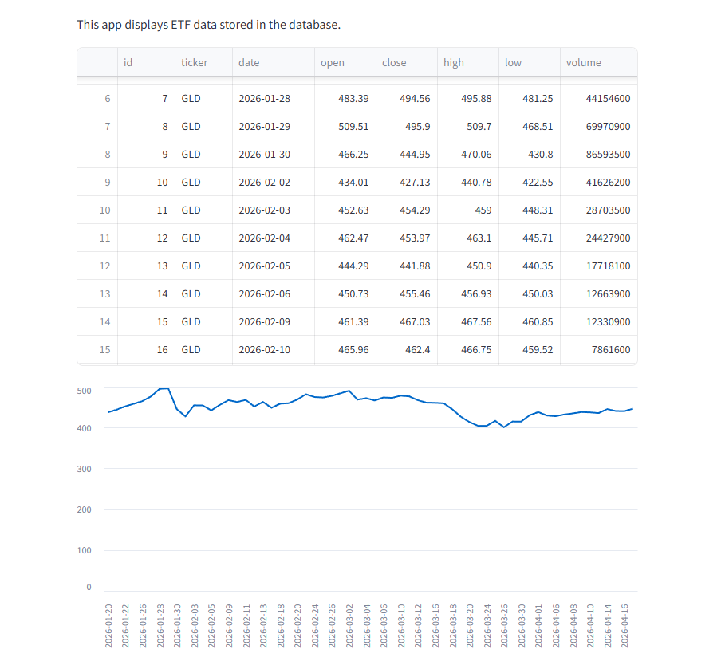
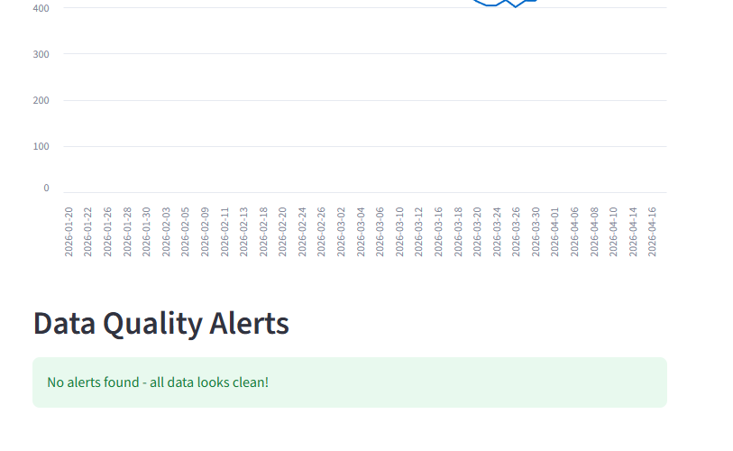

# ETF-Data-Quality-Monitor


# ETF Data Quality Monitor

A Python + SQL data quality monitoring tool that pulls ETF price data from Yahoo Finance, stores it in a SQLite database, and runs automated checks to flag data integrity issues. Built to demonstrate skills relevant to financial technology operations.

## What It Does

This tool monitors daily price data for 5 ETFs (SPY, QQQ, IVV, AGG, GLD) and flags potential data quality issues such as:

- **Missing data** — detects if an ETF has fewer trading days than expected
- **Abnormal price movements** — flags any day where the price moved more than 10%
- **Low volume anomalies** — identifies days where trading volume dropped below 30% of the average
- **Duplicate records** — catches any repeated entries for the same ticker and date

Results are displayed in an interactive Streamlit dashboard showing price charts and a summary of all alerts.

## Tech Stack

- **Python** — core language
- **SQLite** — lightweight relational database for storing price data and alerts
- **yfinance** — pulls free historical ETF data from Yahoo Finance
- **pandas** — data manipulation and analysis
- **Streamlit** — interactive web dashboard

## Project Structure

```
ETF-Data-Quality-Monitor/
├── setup.py       # Creates the database and tables
├── main.py        # Pulls ETF data from Yahoo Finance and loads it into the database
├── checks.py      # Runs data quality checks and logs alerts
├── app.py         # Streamlit dashboard to view data and alerts
├── etf_monitor.db # SQLite database (generated after running setup.py)
├── README.md
└── requirements.txt
```

## How to Run

### 1. Install dependencies

```bash
pip install yfinance pandas streamlit
```

### 2. Create the database

```bash
python setup.py
```

### 3. Load ETF data

```bash
python main.py
```

### 4. Run data quality checks

```bash
python checks.py
```

### 5. Launch the dashboard

```bash
python -m streamlit run app.py
```

## Database Schema

The SQLite database contains three tables:

**etfs** — stores ETF ticker symbols and names

| Column | Type    | Description          |
|--------|---------|----------------------|
| id     | INTEGER | Primary key          |
| ticker | TEXT    | ETF symbol (e.g. SPY)|
| name   | TEXT    | Full ETF name        |

**daily_prices** — stores historical price data

| Column | Type    | Description            |
|--------|---------|------------------------|
| id     | INTEGER | Primary key            |
| ticker | TEXT    | ETF symbol             |
| date   | TEXT    | Trading date           |
| open   | REAL    | Opening price          |
| close  | REAL    | Closing price          |
| high   | REAL    | Daily high             |
| low    | REAL    | Daily low              |
| volume | INTEGER | Number of shares traded|

**alerts** — stores data quality issues found by checks

| Column  | Type    | Description          |
|---------|---------|----------------------|
| id      | INTEGER | Primary key          |
| type    | TEXT    | Alert category       |
| message | TEXT    | Description of issue |
| date    | TEXT    | Date of occurrence   |

## Skills Demonstrated

- SQL database design with constraints (PRIMARY KEY, NOT NULL)
- Python scripting for data pipelines (extract, load)
- Data quality validation and anomaly detection
- Building interactive dashboards with Streamlit
- Working with financial data (ETF prices, volume, returns)